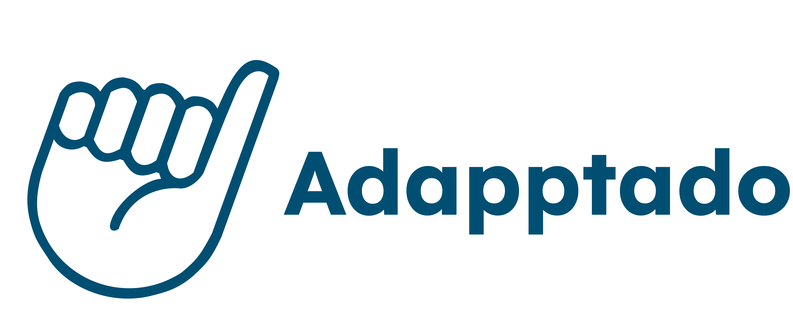

<div align="center">

  

  <br/>

  <h3><b>Ad<em><strong>app</strong></em>tado</b><h3>

</div>


# [Ad<em><strong>app</strong></em>tado]

<!-- Tabla de contenidos -->

# 📗 Tabla de Contenidos
- [⬇️ Tabla de Contenidos](#tabla-de-contenidos)
- [📖 Adapptado](#adapptado)
  - [🛠 Stack Tecnológico](#stack-tecnologico)
  - [🚀 Live Demo](#live-demo)
  - [💻 Para comenzar](#para-comenzar)
    - [Prerequisitos](#prerequisitos)
    - [Setup](#setup)
    - [Uso](#uso)
  - [👥 Autores y roles asignados](#autores-y-roles-asignados)
  - [🔭 Funcionalidades futuras](#funcionalidades-futuras)
  - [🤝 Contribuciones](#contribuciones)
  - [⭐️ Muestra tu apoyo](#muestra-tu-apoyo)
  - [🙏 Agradecimientos](#agradecimientos)
  - [📝 Licencia](#licencia)

<!-- Descripción del proyecto -->

# 📖 Adapptado

Adapptado es una aplicación web diseñada para facilitar la vida de las personas discapacitadas al proporcionar información sobre la accesibilidad de lugares públicos y privados. Los usuarios pueden compartir sus experiencias y evaluar la accesibilidad de tiendas, restaurantes, bares, estacionamientos, stadiums, parques, museos, centros comerciales y otros establecimientos, permitiendo que otros usuarios tomen decisiones informadas sobre a dónde ir. De esta manera, el usuario sabrá de antemano si el sitio a visitar está adaptado, o no, a sus necesidades.

<!-- Stack Tencológico -->

## 🛠 Stack Tecnológico

1- Drive
2.- Google Docs.
3.- Google Sheet
4.- Trello.
5.- Figma.
6.- Figjam
7.- HTML.  
8- Tailwind CSS.  
9- React Js.
10.- Next Js.
11.- Java.
12.- Spring.
13.- JUnit.
14.- Mockito.
15. JWT.
16.- PostGreSQL
17.- AWS.
18.- Terraform

<!-- Live Demo -->

## 🚀 Live Demo

- Coming soon.

<p align="right"><a href="#tabla-de-contenidos">(back to top)</a></p>

<!-- Para comenzar -->

## 💻 Para comenzar

### Prerequisitos

Para poder correr este MVP necesitas:

- Una terminal ya sea en S.O. Windows o S.O. Linux, o mejor aún, un editor de código.
- Un navegador web.
- Conocimientos básicos de Git y GitHub.

### Setup

Para obtener una copia local, clona este repositorio a la carpeta local que desees, así como sigue:

```sh
cd "my-folder"
git clone https://github.com/No-Country-simulation/c23-105-webapp
```

### Uso

1. Luego abre una terminal y ve al directorio donde clonaste el proyecto.
2. Después instala las dependencias con `npm install`.
3. Seguidamente, levanta el servidor de desarrollo con `npm run dev`.
4. La terminal te mostrará un enlace (por defecto, por ejemplo, http://localhost:5173) donde puedes ver la aplicación corriendo. 🚀

<p align="right"><a href="#tabla-de-contenidos">(back to top)</a></p>

<!-- Autores y roles asignados -->

## 👥 Autores y roles asignados

👤 **Luis Laverde: Product Manager & Tester QA Manual**  
📧 luislaverde@gmail.com  
🔗 [LinkedIn](https://www.linkedin.com/in/luis-laverde-functional-analyst-tester-and-developer/)  

👤 **Nicolas Luis: Ux/Ui Designer**  
📧 nicolas.luis11@gmail.com  
🔗 [LinkedIn](https://www.linkedin.com/in/nicolasluis/)  

👤 **Omar Vera: Frontend Developer**  
📧 veraomar50@gmail.com  
🔗 [LinkedIn](https://www.linkedin.com/in/omar-vera-a74b71249/)  

👤 **Bruno Collazo: Backend Developer**  
📧 collazobruno2@gmail.com  
🔗 [LinkedIn](https://www.linkedin.com/in/brunocollazo/)  

<p align="right"><a href="#tabla-de-contenidos">(back to top)</a></p>

<!-- Funcionalidades Futuras -->

## 🔭 Funcionalidades futuras

- [ ] Añadir un buscador.
- [ ] Implementar ubicación en tiempo real de los lugares en Google Maps.
- [ ] Crear un avatar a cada usuario con su foto.

<p align="right"><a href="#tabla-de-contenidos">(back to top)</a></p>

<!-- Contribuciones -->

## 🤝 Contribuciones

¡Contribuciones, mejoras y solicitud de nuevas funcionalidades son bienvenidas!  
Para más información, contáctanos en: [correo o redes sociales a definir]

<p align="right"><a href="#tabla-de-contenidos">(back to top)</a></p>

<!-- Muestra tu apoyo -->

## ⭐️ Muestra tu apoyo

Si te gustó este MVP, por favor regálanos una estrella ⭐.

<p align="right"><a href="#tabla-de-contenidos">(back to top)</a></p>

<!-- Agradecimientos -->

## 🙏 Agradecimientos

Nos gustaría agradecer a la organización No Country por darnos la oportunidad de aplicar lo aprendido y mostrarnos el camino para convertirnos en excelentes profesionales.

<p align="right"><a href="#tabla-de-contenidos">(back to top)</a></p>

<!-- Licencia -->

## 📝 Licencia

Este MVP está bajo la licencia [MIT](./LICENSE).

<p align="right"><a href="#tabla-de-contenidos">(back to top)</a></p>
